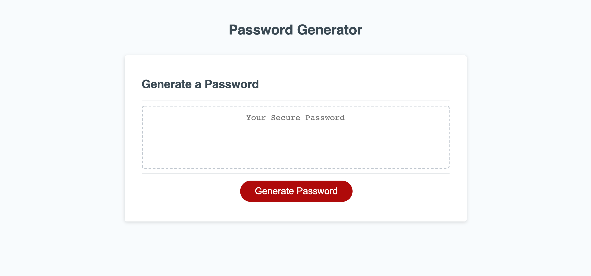
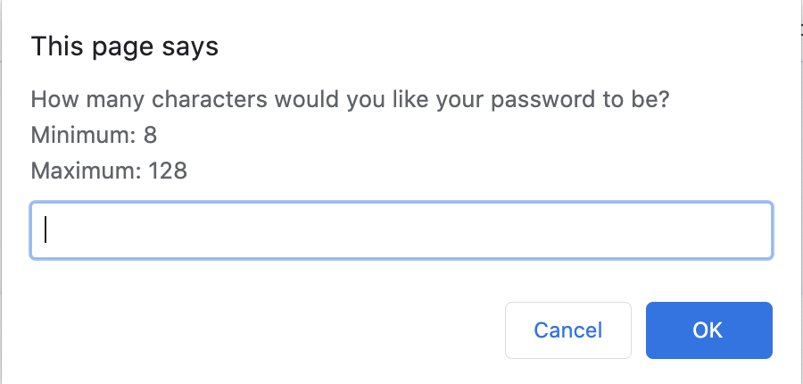
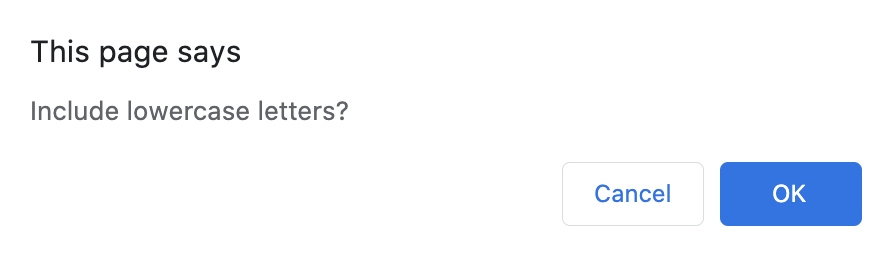
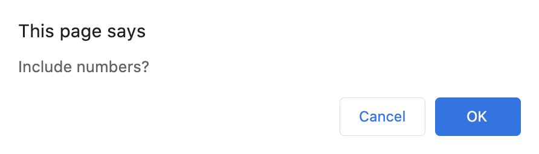
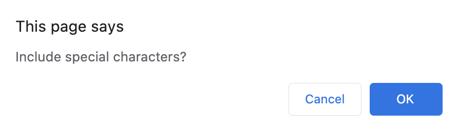
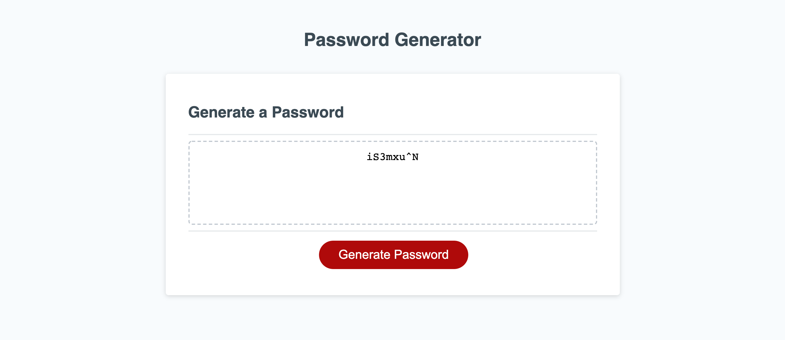
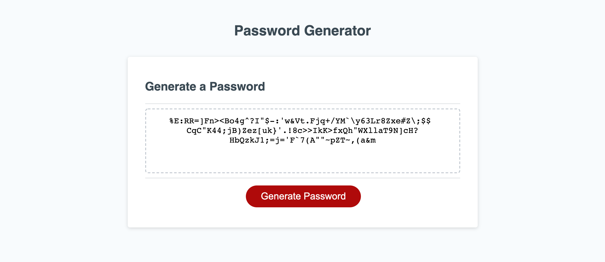

## Description 
An application that generates a random password based on user-selected criteria. This app runs in the browser and features dynamically updated HTML and CSS powered by JavaScript code. It also features a clean and polished user interface and is responsive, ensuring that it adapts to multiple screen sizes.

Check out the deployable site here: [Password Generator](https://jaredp17.github.io/PasswordGenerator/).

## Usage
1. Clone the repo or open deployable site.
    * Open index.html in default browser (if cloned).
2. Click _Generate Password_ and follow the prompts.

## Preview
The following images demonstrate the application functionality:

Prompts following button press of _Generate Password_:

Sample output (8 and 128 lengths) with all characters included:

## Credits
This site was designed by the Georgia Tech curriculum team. I wrote the javascript code to generate the password based on their criteria.  

## Contributing
I am the sole contributor to this project. 

## Licenses

Copyright (c) 2020 Jared Porter

Permission is hereby granted, free of charge, to any person obtaining a copy of this software and associated documentation files (the "Software"), to deal in the Software without restriction, including without limitation the rights to use, copy, modify, merge, publish, distribute, sublicense, and/or sell copies of the Software, and to permit persons to whom the Software is furnished to do so, subject to the following conditions:

The above copyright notice and this permission notice shall be included in all copies or substantial portions of the Software.

THE SOFTWARE IS PROVIDED "AS IS", WITHOUT WARRANTY OF ANY KIND, EXPRESS OR IMPLIED, INCLUDING BUT NOT LIMITED TO THE WARRANTIES OF MERCHANTABILITY, FITNESS FOR A PARTICULAR PURPOSE AND NONINFRINGEMENT. IN NO EVENT SHALL THE AUTHORS OR COPYRIGHT HOLDERS BE LIABLE FOR ANY CLAIM, DAMAGES OR OTHER LIABILITY, WHETHER IN AN ACTION OF CONTRACT, TORT OR OTHERWISE, ARISING FROM, OUT OF OR IN CONNECTION WITH THE SOFTWARE OR THE USE OR OTHER DEALINGS IN THE SOFTWARE.